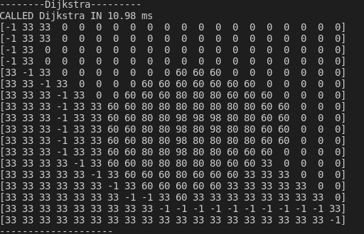
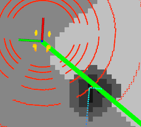

Планировщик на основе алгоритма Дейкстры без использования сторонних библиотек.  
1) Особенности реализации  
  Самый простой алгоритм Дейкстры. Из всего occupancy кропается карта по начальной и конечной точке, потом на ней происходит планирование. Результаты на png в репо. 
3) Запуск  
  положить в worskpace вместе с пакетом кастомных сообщений  
3) TODO  
  - отладить ошибки с разными направлениями (запускается только если точка справа снизу от рообота)
  - добавить параметр extra чтобы карта не ограничивалась прямоугольником начальной и конечной точки, а была компромиссом между скоростью работы и полезной площадью поиска
  - доделать перенос из cropped_occup_grid и публикацию сообщения в ROS

Выполнил Линок С.А.

